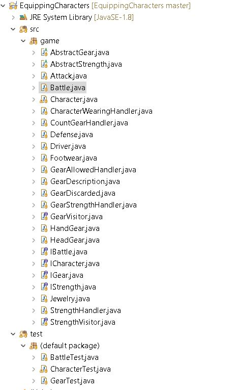
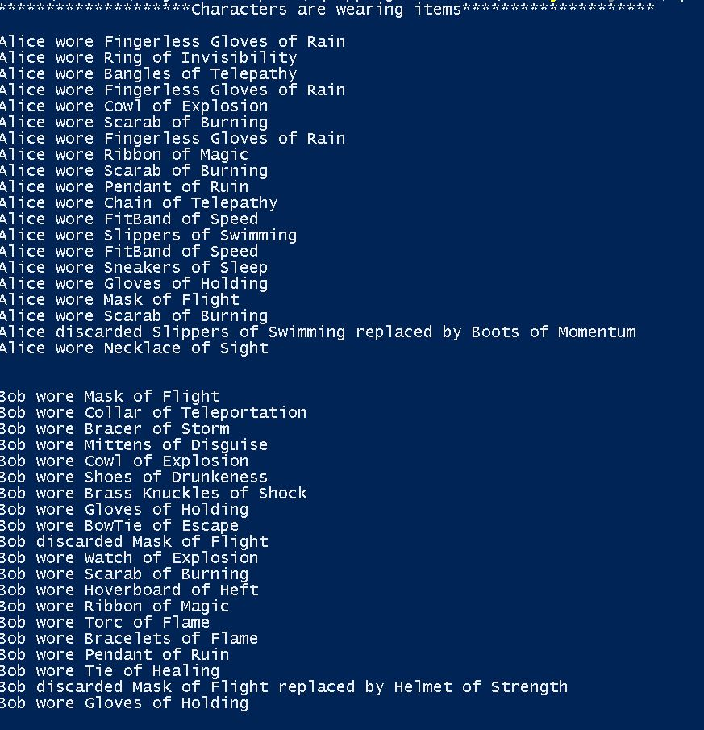
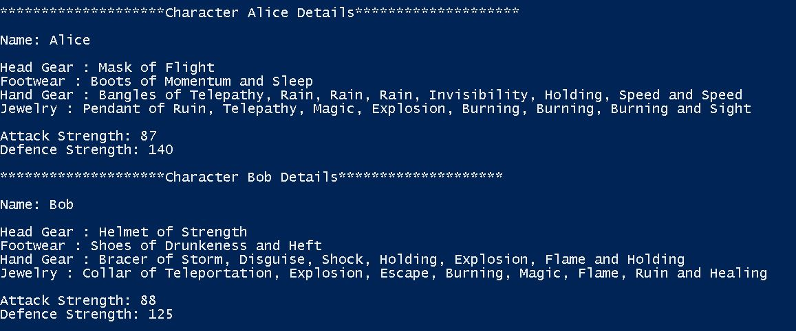
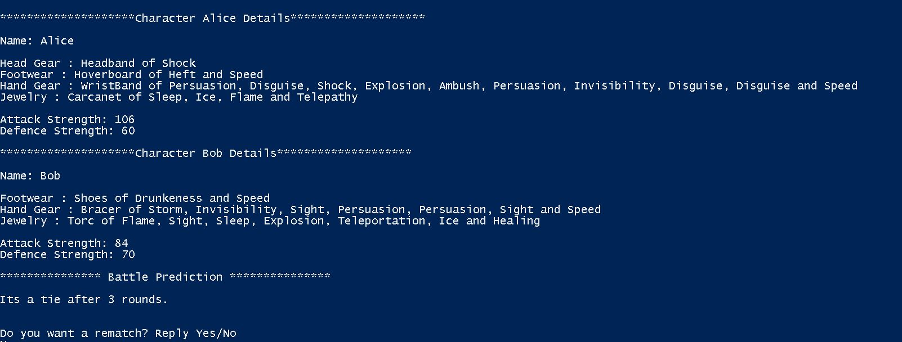

# Role-Playing Game

## Overview
Requirement is to design and implement a model to help keep track of characters which will be able to enhance their basic abilities by "wearing" different items. In game, characters can wear four different types of clothing:
-  Head gear: These items go on the character’s head (hats/helmets/visors) and are only useful for defense.
- Footwear: These items go on the character’s feet (boots/sneakers/hoverboard) and are only used for attack. Since character's have 2 feet, they can have 2 of these items.
- Hand gear: These items go on the character’s fingers/hands and can be for either attack or defense. Since character's have 10 fingers, they can have 10 of these items.
- Jewelry: These items go around the character's neck and can be used for either attack or defense. There is no limit to the number of these items that the character can have.

## List of features.
- In addition to current hit points, characters begin with a basic attack power and defensive strength (represented as numerical values). As they go through the game, they can pick up new items based on how many items of a particular type that they can wear.
- The attack or defensive power of the items that a character is wearing temporarily adds (or subtracts in the case of a cursed item) to the players attack power and defensive strength.
- When describing what a character is wearing, the names of items of the same type are combined. The new grammatically correct name is the full name of the first item, and the adjective of the others. For example (order does not matter):
    * To combine "Sandals of Speed" and "Hoverboard of Heft", you would get "Hoverboard of Heft and Speed".
    * To combine "Gloves of Holding", Ring of Invisibility", "Ring of Electrical Shock", you would get "Gloves of Holding, Invisibility, and Electrical Shock".
- Some items wear out with each use and thus their benefit decreases each time a player uses them. Characters that continue to wear and use worn-out items find that these items decrease their basic attack power and defensive strength.

## How To Run. 

Game package will have the below mentioned folder structure: 



- jar file is saved in the \res folder

- Open the \res folder in command shell

- run the command as below, program doesnt need any arguments from the user
 
```sh
> java -jar .\EquippingCharacters.jar
```
 
 
                              

 ## How to Use the Program.
     
There is user interaction when user wants to rematch, in this characters to play a rematch in which case they should be allowed to "dress" in a new selection of items, so user just have to run the jar file as mentioned above and after one match played, they could choose whether they want to rematch by typing as Yes and if no rematch, then they can type as No. All other inputs will be considered as invalid and no rematch will happen.
    
## Description of Example Runs

Results of running the EquippingCharacters.jar file

```sh  
PS java -jar .\EquippingCharacters.jar
********************Characters are wearing items********************

Alice wore Fingerless Gloves of Rain
Alice wore Ring of Invisibility
Alice wore Bangles of Telepathy
Alice wore Fingerless Gloves of Rain
Alice wore Cowl of Explosion
Alice wore Scarab of Burning
Alice wore Fingerless Gloves of Rain
Alice wore Ribbon of Magic
Alice wore Scarab of Burning
Alice wore Pendant of Ruin
Alice wore Chain of Telepathy
Alice wore FitBand of Speed
Alice wore Slippers of Swimming
Alice wore FitBand of Speed
Alice wore Sneakers of Sleep
Alice wore Gloves of Holding
Alice wore Mask of Flight
Alice wore Scarab of Burning
Alice discarded Slippers of Swimming replaced by Boots of Momentum
Alice wore Necklace of Sight


Bob wore Mask of Flight
Bob wore Collar of Teleportation
Bob wore Bracer of Storm
Bob wore Mittens of Disguise
Bob wore Cowl of Explosion
Bob wore Shoes of Drunkeness
Bob wore Brass Knuckles of Shock
Bob wore Gloves of Holding
Bob wore BowTie of Escape
Bob discarded Mask of Flight
Bob wore Watch of Explosion
Bob wore Scarab of Burning
Bob wore Hoverboard of Heft
Bob wore Ribbon of Magic
Bob wore Torc of Flame
Bob wore Bracelets of Flame
Bob wore Pendant of Ruin
Bob wore Tie of Healing
Bob discarded Mask of Flight replaced by Helmet of Strength
Bob wore Gloves of Holding


********************Character Alice Details********************

Name: Alice

Head Gear : Mask of Flight
Footwear : Boots of Momentum and Sleep
Hand Gear : Bangles of Telepathy, Rain, Rain, Rain, Invisibility, Holding, Speed and Speed
Jewelry : Pendant of Ruin, Telepathy, Magic, Explosion, Burning, Burning, Burning and Sight

Attack Strength: 87
Defence Strength: 140

********************Character Bob Details********************

Name: Bob

Head Gear : Helmet of Strength
Footwear : Shoes of Drunkeness and Heft
Hand Gear : Bracer of Storm, Disguise, Shock, Holding, Explosion, Flame and Holding
Jewelry : Collar of Teleportation, Explosion, Escape, Burning, Magic, Flame, Ruin and Healing

Attack Strength: 88
Defence Strength: 125

*************** Battle Prediction ***************

Alice is a winner, lasted 4 rounds.


Do you want a rematch? Reply Yes/No
```
## These are the ouputs for different requirements:
 
- "Dress" each character with a random 20 items from the chest of gear (duplicates allowed). When items are selected the character can chose to wear them based on:
    * Whether the item can be combined with what they are already wearing. If they cannot be combined with what they are already wearing, the character can choose to wear the new item discarding an item they are already wearing. Print out any items that are discarded along what item took its place.
    * Whether the item would improve their basic attack power or defense strength. Characters always choose a higher attack strength over a higher defense strength
  
  
  
  
- Print out each character in the battle along with what they are wearing and their attack and defense strength
  
  
 
  
- Predict which of the two characters would win in a battle by calculating the number of rounds a character would survive if attacked by the other player. For example, suppose that Alice and Bob have been properly equipped from the chest of gear. First calculate the potential damage that each player can inflict on the other in each round:
    
    damageAlice = attackBob - defenseAlice
    damageBob = attackAlice - defenseBob

    Assuming that the calculated potential damage is inflicted each round, calculate the number of rounds each player would last based on their hit points. Then predict the winner as the player that would last the most number of rounds by printing this information to the screen. If the players would last the same number of rounds, you should predict a tie.
  
  
  
 
- Provide the option for the characters to play a rematch in which case they should be allowed to "dress" in a new selection of items. This should be the only keyboard input required to use your driver program. 
  
  

    * If user types "Yes"
  
    
    
    
    
     * If user types "No"
  
    
    
    * If user types invalid input
  
    
    
## Design/Model Changes

### - Version 2.0
##### ICharacter interface:
It provides the methods like adding gears to the character, getting details about the character, predictwinner of the match and also the getHitPoints of the character; in which driver is interested to create/test the game.

##### Character class:
This is the concrete implementation of the ICharacter interface, which provides the implementation of all the required methods (getting details about the character, predictwinner of the match and also the getHitPoints of the character;) This class also maintain the list of gears the character is wearing and also the list of gears the characters discarded.

##### IStrength interface which implementd the <Comparable> Interface
This is the interface for the strength of an character or gear
This interface provides methods for the visitor class to get into appropriate gear or character's strength type and get the value of the strength they are having

##### Intuition:
This I had to add because to get the value of the strength each gear or character is having, and I thought visitor pattern is best way to implement the double dispatch.

##### AbstractStrength class:
This is the concrete implementation of the IStrength which provides the implementation of the accept methods and facilitates the visitor.

##### Intuition:
Attack and Defense classes which extends the AbstractStrength provides different implementation for compareTo() and accept() which will used for getting the strength value back to the character/gear class.

##### IGear interface, implements <Comparable>
This interface provides definitions for a Gear, 

##### Abstract Gear class:
This provides the common and most of the implementation for the gear, it maintains the gear description, strength of the gear which is common to all of the gears.

##### IGear concrete classes:
HandGear, HeadGear, Footwear, Jewelry classes which extends AbstractGear class, provides the implementation of compareTo, and accept classes which are needed while adding a gear to the character, also to get the current count of particular type of gear.

##### GearVistor interface:
It declares the visit operations for all the types of classes of type IGear which can be visited (# of gears allowed for a particular type, to get strength of particular type attack or defense, to get the count of particular gear type)

##### CharacterWearingHandler class
This class implements the Gear Visitor interface. It handles the description representation of different types of gears character is wearing by traversing through all gear types using the visit()

##### CountGearHandler interface
This class implements the Gear Visitor interface. It handles the count of gear a character is wearing using the visit()

##### GearAllowedHandler interface
This class implements the Gear Visitor interface. It handles whether a gear can be added to the list before comparing with the existing list of gears by using the visit methods()

##### GearStrengthHandler interface
This class implements the Gear Visitor interface. It handles the calculation of the gear strength considering wear out percentage in the given round using visit()

##### StrengthVisitor interface:
It declares the visit operations for all the types of classes of type IStrength which can be visited.

##### StrengthHandler class
This class implements the Gear Visitor interface. It handles the attack and defense values of character or gear.

##### There are other supporting class which defines the description of a gear GearDescription


### - Version 1.0:
##### IRolePlayer Interface class:
Provides interface functionality for the user/driver to perform functions like add an character, add an gear to the character, and also I was thinking will do predictWin and rematch win in the driver class rather than inside any concrete class
   
##### Role Player Builder class:
   Intuition for this class was to create different characters and each character internally added with gears, similar to medivalBuilder where we create levels (in here its characters), so each levels will have its own monsters and treasures (in here it will be gears). I thought I can use builder pattern to create a character and update the items its using
   
##### ICharacter Interface:
   Provides the feature sets which defines a characters
   
##### Character class:
   Concrete class which implements the ICharacter, which holds all information about the character, the number of gears it holds, attack strength and defense strength

##### IGear Interface
   Provides definition for an gear or item.
   
##### Abstract Gear class:
   It provides implementation of how the geat should behave and how to give the character class about the gear attack and defense strength when queried.
   
   There are other supporting classes which helps to define the gear information and also strength information like Strength class, Gear Description class
   
   HeadGear, HandGear, JewlleryGear, FootwearGear, extends the Abstract Gear class, and implements its won specific compareTo functions when queried.
   
# ASSUMPTIONS
 
1) Cursed items will have negative value for Attack or Defence.
2) If character is wearing duplicate items( "Sandals of Speed" x 2 ) then it will be described as "Sandals of Speed and Speed".
3) HandGear and Jewelery items will either have Attack or Defence not both.
4) While choosing gears beyond the limit, character always choose attack strength over a defense strength.
5) While choosing gear, if the given gear is not better than any of the gears character currently wearing then it will get discarded without replacing any existing item.
6) If the potential damage that each player can inflict on the other in each round becomes negative, then it will be capped to 0.
7) If the attack or defence of character becomes negative, then it will be capped to 0.
8) All calculations of attack and defence are done expecting values are integral values. 
9) When user will be given an option to rematch, expected input is yes or no, any other value will be considered as invalid and no rematch will happen.
10) Each gear has worn out percentage which will decrease its strength in each round.
11) Whenever user chooses to rematch, all the details regrading what character is wearing after new population of chest and the charcter details will be printed along with battle prediction.
  
# Limitations
 None

