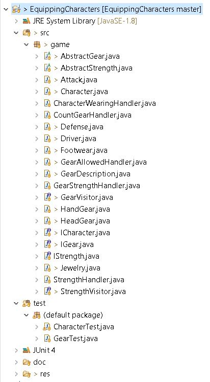

# Role-Playing Game

## Overview
Requirement is to design and implement a model to help keep track of characters which will be able to enhance their basic abilities by "wearing" different items. In game, characters can wear four different types of clothing:
-  Head gear: These items go on the character’s head (hats/helmets/visors) and are only useful for defense.
- Footwear: These items go on the character’s feet (boots/sneakers/hoverboard) and are only used for attack. Since character's have 2 feet, they can have 2 of these items.
- Hand gear: These items go on the character’s fingers/hands and can be for either attack or defense. Since character's have 10 fingers, they can have 10 of these items.
- Jewelry: These items go around the character's neck and can be used for either attack or defense. There is no limit to the number of these items that the character can have.

## List of features.
- In addition to current hit points, characters begin with a basic attack power and defensive strength (represented as numerical values). As they go through the game, they can pick up new items based on how many items of a particular type that they can wear.
- The attack or defensive power of the items that a character is wearing temporarily adds (or subtracts in the case of a cursed item) to the players attack power and defensive strength.
- When describing what a character is wearing, the names of items of the same type are combined. The new grammatically correct name is the full name of the first item, and the adjective of the others. For example (order does not matter):
    * To combine "Sandals of Speed" and "Hoverboard of Heft", you would get "Hoverboard of Heft and Speed".
    * To combine "Gloves of Holding", Ring of Invisibility", "Ring of Electrical Shock", you would get "Gloves of Holding, Invisibility, and Electrical Shock".
- Some items wear out with each use and thus their benefit decreases each time a player uses them. Characters that continue to wear and use worn-out items find that these items decrease their basic attack power and defensive strength.

## How To Run. 

Game package will have the below mentioned folder structure: 



- jar file is saved in the \res folder

- Open the \res folder in command shell

- run the command as below, program doesnt need any arguments from the user
 
```sh
> java -jar .\EquippingCharacters.jar
```
 
 
                              

 ## How to Use the Program.
     
    There is user interaction when user wants to rematch, in this characters to play a rematch in which case they should be allowed to "dress" in a new selection of items, so user just have to run the jar file as mentioned above and after one match played, they could choose whether they want to rematch by typing as Yes and if no rematch, then they can type as No. All other inputs will be considered as invalid and no rematch will happen.
    
## Description of Example Runs

Results of running the EquippingCharacters.jar file

```sh  
PS java -jar .\EquippingCharacters.jar
********************Characters are wearing items********************

Alice wore Fingerless Gloves of Rain
Alice wore Ring of Invisibility
Alice wore Bangles of Telepathy
Alice wore Fingerless Gloves of Rain
Alice wore Cowl of Explosion
Alice wore Scarab of Burning
Alice wore Fingerless Gloves of Rain
Alice wore Ribbon of Magic
Alice wore Scarab of Burning
Alice wore Pendant of Ruin
Alice wore Chain of Telepathy
Alice wore FitBand of Speed
Alice wore Slippers of Swimming
Alice wore FitBand of Speed
Alice wore Sneakers of Sleep
Alice wore Gloves of Holding
Alice wore Mask of Flight
Alice wore Scarab of Burning
Alice discarded Slippers of Swimming replaced by Boots of Momentum
Alice wore Necklace of Sight


Bob wore Mask of Flight
Bob wore Collar of Teleportation
Bob wore Bracer of Storm
Bob wore Mittens of Disguise
Bob wore Cowl of Explosion
Bob wore Shoes of Drunkeness
Bob wore Brass Knuckles of Shock
Bob wore Gloves of Holding
Bob wore BowTie of Escape
Bob discarded Mask of Flight
Bob wore Watch of Explosion
Bob wore Scarab of Burning
Bob wore Hoverboard of Heft
Bob wore Ribbon of Magic
Bob wore Torc of Flame
Bob wore Bracelets of Flame
Bob wore Pendant of Ruin
Bob wore Tie of Healing
Bob discarded Mask of Flight replaced by Helmet of Strength
Bob wore Gloves of Holding


********************Character Alice Details********************

Name: Alice

Head Gear : Mask of Flight
Footwear : Boots of Momentum and Sleep
Hand Gear : Bangles of Telepathy, Rain, Rain, Rain, Invisibility, Holding, Speed and Speed
Jewelry : Pendant of Ruin, Telepathy, Magic, Explosion, Burning, Burning, Burning and Sight

Attack Strength: 87
Defence Strength: 140

********************Character Bob Details********************

Name: Bob

Head Gear : Helmet of Strength
Footwear : Shoes of Drunkeness and Heft
Hand Gear : Bracer of Storm, Disguise, Shock, Holding, Explosion, Flame and Holding
Jewelry : Collar of Teleportation, Explosion, Escape, Burning, Magic, Flame, Ruin and Healing

Attack Strength: 88
Defence Strength: 125

*************** Battle Prediction ***************

Alice is a winner, lasted 4 rounds.


Do you want a rematch? Reply Yes/No
```
## These are the ouputs for different requirements:
 
- "Dress" each character with a random 20 items from the chest of gear (duplicates allowed). When items are selected the character can chose to wear them based on:
    * Whether the item can be combined with what they are already wearing. If they cannot be combined with what they are already wearing, the character can choose to wear the new item discarding an item they are already wearing. Print out any items that are discarded along what item took its place.
    * Whether the item would improve their basic attack power or defense strength. Characters always choose a higher attack strength over a higher defense strength
  
  
  
  
- Print out each character in the battle along with what they are wearing and their attack and defense strength
  
  
 
  
- Predict which of the two characters would win in a battle by calculating the number of rounds a character would survive if attacked by the other player. For example, suppose that Alice and Bob have been properly equipped from the chest of gear. First calculate the potential damage that each player can inflict on the other in each round:
    
    damageAlice = attackBob - defenseAlice
    damageBob = attackAlice - defenseBob

    Assuming that the calculated potential damage is inflicted each round, calculate the number of rounds each player would last based on their hit points. Then predict the winner as the player that would last the most number of rounds by printing this information to the screen. If the players would last the same number of rounds, you should predict a tie.
  
  
  
 
- Provide the option for the characters to play a rematch in which case they should be allowed to "dress" in a new selection of items. This should be the only keyboard input required to use your driver program. 
  
  

    * If user types "Yes"
  
    
    
    
    
     * If user types "No"
  
    
    
    * If user types invalid input
  
    
    
## Design/Model Changes

### - Version 2.0

#### ICharacter Interface:
Provides the Interface class to the user which exposes all the funcitonality/requirements APIs to the user (addSpecies, printHabitat map, ...).
    
Abstract conservancy class is removed since can't predict the common feature required for different additional houses.
    
#### ReptileHouses class:
It implements the IReptileHouse interface, interacts with the IHabitat interface to get/set habitat specific details (1 --> * relation) and uses ISpecies for getting the species related details (1 --> * relation).
    
##### IHabitat Interface:
Provides the skeleton for the Habitat class
    
Abstract Habitat  class is removed since can't predict the common feature required for different habitats.
    
##### Habitat class:
This class implements the IHabitat interface, like  addSpecies, addnaturalFeatures which were common to all habitats. This class interacts with the ISpecies interface to get/set species specific information (addSpecies to Habitat, get species compatibility,...) (1 --> * relation)
   
##### ISpecies Interface;
Provides the skeleton for the species APIs
   
Abstract Species  class is removed since can't predict the common feature required for different species.
   
##### Species class:
This class implements the ISpecies Interface which provides implementation specific to species.It provides methods required for habitat and Reptile house to implement the requirements.
   
##### HabitatSpeciesDetails:
This is supporting class maintains the details about the habitat's species. When the species are added to the habitat, habitat's characteristics changes like natural features, temperature range, remaining size of the habitat. This class is used to maintain all these details and will be used to set the habitat charecteristics, which is also reduces number of calls we do to the species class
   
There are other supporting class like SpeciesIndicators to maintain if species is (Poisonous, endangered, ..), SpeceisSize( small, medium, ..).
   
   
### - Version 1.0:
   
##### Convervancy Interface: 
Initially I have provided this Interface class to the user which exposes all the funcitonality/requirments APIs to the user (addSpecies, printHabitat map, ...).
   
##### Conservancy abstract class:
This abstract class implements the conservancy interface and provides the concrete class for all the APIS. Reptile house extends this abstract class. 
   
Idea behind this desgin was if in the future if there was a requirement for another bird conservancy or fish conservancy we can extend this class which has all the required APIS implemented.

##### Reptile House class:
This class extends the Conservancy abstract class which provides the implementation of all user APIs. This class only provides implementation specific to the resptile house.
   
##### Habitat Interface:
Provides the skeleton for the Habitat class
   
##### Abstract habitat class:
This class implements the habitat interface, like  addSpecies, addnaturalFeatures which were common to all habitats. 
Intuition of making this class abstract is to keep the common features of all habitat in one place and if there is any future requirement of adding warm blodded habitat we can use this class to get the common habitat implementation.
   
##### Coldbloddedhabitat:
This class extends the AbstractHabitat class which provides implementation specific to cold blodded habitat. 
   
##### Species Interface:
Provides the skeleton for the species APIs
   
##### Abstract Species class:
Implements the APIS needed for the species interface.
   
##### Coldblodded species:
This class extends the Abstractspecies class which provides implementation specific to cold blodded species.
   
There are another supporting classes which are used by other reptile, habitat and species concrete classes.
   
   
# ASSUMPTIONS
 
1) Cursed items will have negative value for Attack or Defence.
2) If character is wearing duplicate items then it will be described as "Sandals of Speed and Speed".
3) HandGear and Jewelery items will either have Attack or Defence not both.
4) While choosing gears beyond the limit, character always choose attack strength over a defense strength.
5) While choosing gear, if the given gear is not better than any of the gears character currently wearing then it will get discarded without replacing any existing item.
6) If the potential damage that each player can inflict on the other in each round becomes negative, then it will be capped to 0.
7) If the attack or defence of character becomes negative, then it will be capped to 0.
8) All calculations of attack and defence are done expecting values are integral values. 
9) When user will be given an option to rematch, expected input is yes or no, any other value will be considered as invalid and no rematch will happen.
10) Each gear has worn out percentage which will decrease its strength in each round.
  
# Limitations
 None